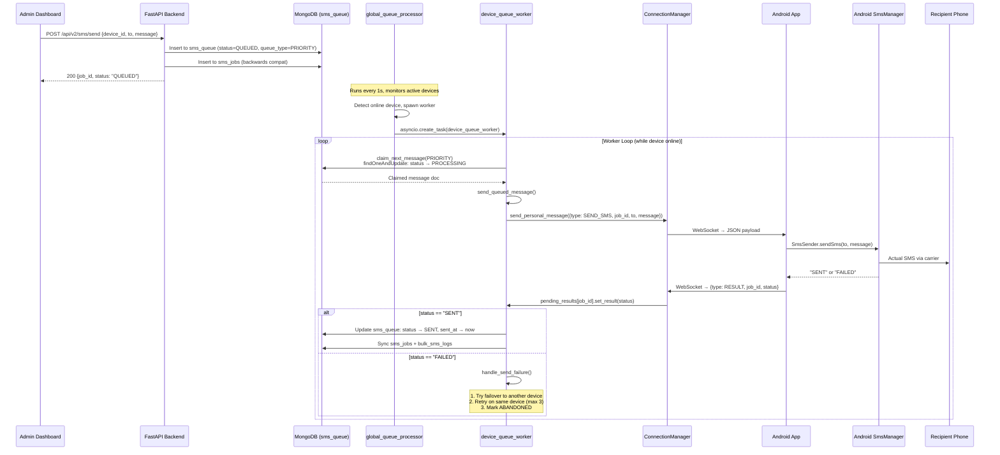
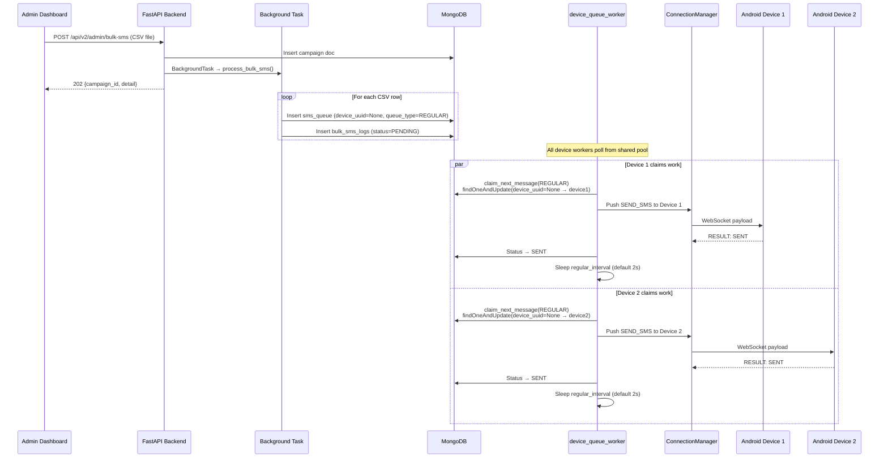
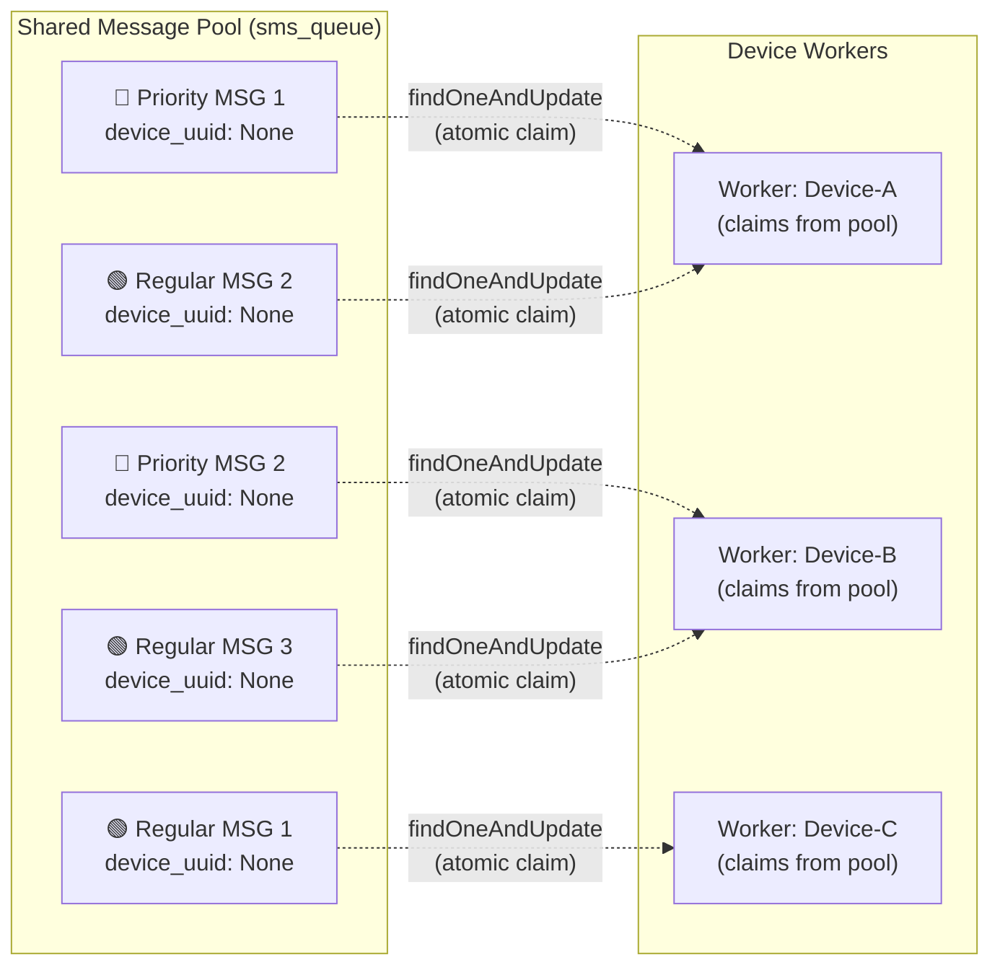
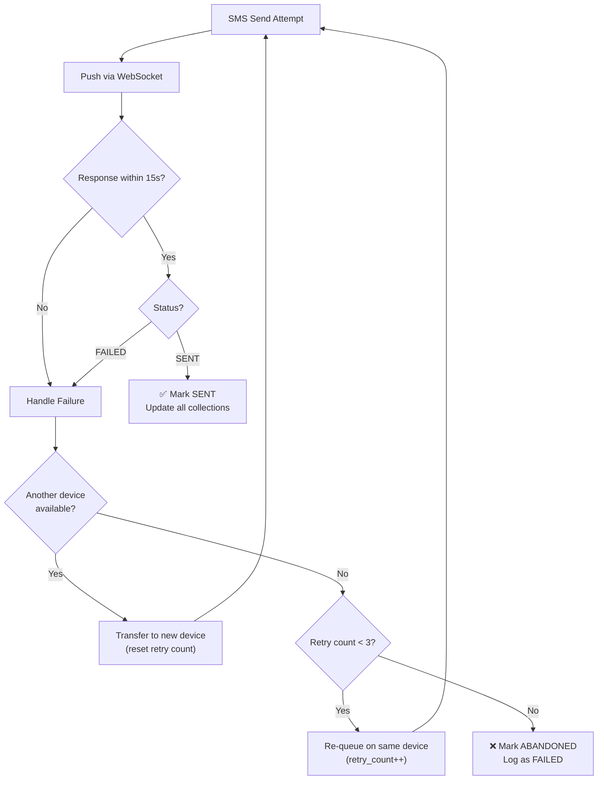

# OpenRelay — System Architecture & SMS Send Logic

## System Architecture Diagram

```mermaid
graph TB
    subgraph "Frontend — React + Vite + TailwindCSS"
        UI["Admin Dashboard<br/>(React SPA)"]
        Login["LoginScreen"]
        SMS["SmsTab — Single SMS"]
        Bulk["BulkTab — CSV Upload"]
        Devices["DevicesTab — Device Monitor"]
        Logs["LogsTab — SMS Logs"]
        Queue["QueueFlowTab — Live Queue"]
        Admin["AdminTab — Settings"]
        UI --> Login
        UI --> SMS
        UI --> Bulk
        UI --> Devices
        UI --> Logs
        UI --> Queue
        UI --> Admin
    end

    subgraph "Backend — FastAPI + MongoDB"
        direction TB
        API["FastAPI Server<br/>(main.py)"]
        
        subgraph "API v2 Endpoints"
            EP_SMS["/api/v2/sms/send<br/>/api/v2/sms/batch"]
            EP_BULK["/api/v2/admin/bulk-sms<br/>/api/v2/admin/campaign"]
            EP_DEV["/api/v2/devices/*"]
            EP_WS["/api/v2/ws/device<br/>(WebSocket)"]
            EP_AUTH["/api/v2/admin/login"]
            EP_STATS["/api/v2/admin/queue/stats"]
        end

        subgraph "Core Engine"
            WS_MGR["ConnectionManager<br/>(websocket.py)"]
            Q_MGR["Queue Manager<br/>(queue_manager.py)"]
            
            subgraph "Queue Manager Functions"
                GQP["global_queue_processor()"]
                DQW["device_queue_worker()"]
                CNM["claim_next_message()"]
                SQM["send_queued_message()"]
                SEL["select_device()"]
                HSF["handle_send_failure()"]
                RAJ["reassign_device_jobs()"]
            end
        end

        subgraph "Database Layer"
            MONGO[(MongoDB)]
            COL_Q["sms_queue"]
            COL_DEV["devices"]
            COL_CAMP["campaigns"]
            COL_LOGS["bulk_sms_logs"]
            COL_JOBS["sms_jobs"]
            MONGO --- COL_Q
            MONGO --- COL_DEV
            MONGO --- COL_CAMP
            MONGO --- COL_LOGS
            MONGO --- COL_JOBS
        end
    end

    subgraph "Android — Flutter App"
        direction TB
        APP["OpenRelay Mobile App"]
        
        subgraph "Services"
            BG_SVC["BackgroundService<br/>(Foreground Notification)"]
            WS_SVC["WebSocketService<br/>(Persistent Connection)"]
            SMS_SEND["SmsSender<br/>(MethodChannel Bridge)"]
            DB_LOCAL["AppDatabase<br/>(SQLite)"]
        end
        
        subgraph "Native Layer"
            KOTLIN["Kotlin MethodChannel<br/>(com.openrelay.app/sms)"]
            SMS_MGR["Android SmsManager"]
            TEL["TelephonyManager"]
        end

        APP --> BG_SVC
        BG_SVC --> WS_SVC
        WS_SVC --> SMS_SEND
        SMS_SEND --> KOTLIN
        KOTLIN --> SMS_MGR
        KOTLIN --> TEL
        WS_SVC --> DB_LOCAL
    end

    %% Cross-layer connections
    UI -- "REST API (HTTP)" --> API
    API --> EP_SMS
    API --> EP_BULK
    API --> EP_DEV
    API --> EP_WS
    API --> EP_AUTH
    API --> EP_STATS

    EP_SMS -- "Insert to sms_queue" --> Q_MGR
    EP_BULK -- "Background Task" --> Q_MGR
    
    WS_SVC -- "WebSocket (wss://)" --> EP_WS
    EP_WS -- "Messages" --> WS_MGR
    Q_MGR -- "Push SEND_SMS" --> WS_MGR
    WS_MGR -- "WebSocket" --> WS_SVC

    GQP --> DQW
    DQW --> CNM
    DQW --> SQM
    SQM --> WS_MGR
    HSF --> SEL
    
    Q_MGR --> MONGO
    EP_WS --> MONGO

    SMS_MGR -. "Carrier Network\n(Actual SMS)" .-> PHONE["📱 Recipient Phone"]
```



---

## The Complete SMS Send Flow

### Single/Batch SMS (Priority Queue)



### Bulk SMS / Campaign (Regular Queue)



---

## Function-by-Function Breakdown

### Backend Core Functions

| Function | File | Purpose |
|---|---|---|
| [global_queue_processor](file:///Users/user/Desktop/OpenRelay/backend/app/queue_manager.py#L365-L411) | queue_manager.py | Infinite loop (1s tick). Monitors `ConnectionManager` for online devices. Spawns/cancels `device_queue_worker` tasks. Recovers orphaned jobs from offline devices back to the shared pool. |
| [device_queue_worker](file:///Users/user/Desktop/OpenRelay/backend/app/queue_manager.py#L267-L328) | queue_manager.py | Per-device async loop. Claims messages from shared pool: **Priority first** (no delay), then **Regular** (with configurable interval). Includes preemptible sleep — breaks early if priority message arrives. |
| [claim_next_message](file:///Users/user/Desktop/OpenRelay/backend/app/queue_manager.py#L117-L147) | queue_manager.py | Atomic `findOneAndUpdate` on `sms_queue`. Claims the oldest unassigned message (`device_uuid=None`) or self-assigned message. Sets status → `PROCESSING`. Ensures no two workers can claim the same message. |
| [send_queued_message](file:///Users/user/Desktop/OpenRelay/backend/app/queue_manager.py#L211-L265) | queue_manager.py | Pushes `SEND_SMS` payload to the device via WebSocket. Creates an `asyncio.Future` in `pending_results`, waits 15s for the device's `RESULT` response. On success → marks SENT. On failure/timeout → calls `handle_send_failure`. |
| [select_device](file:///Users/user/Desktop/OpenRelay/backend/app/queue_manager.py#L16-L115) | queue_manager.py | Scoring algorithm to pick the best device. Factors: signal strength (0-4 → 0-100), battery level, workload (pending jobs), heartbeat freshness, SIM availability. Different weights for campaign (battery-heavy) vs normal mode (signal-heavy). |
| [handle_send_failure](file:///Users/user/Desktop/OpenRelay/backend/app/queue_manager.py#L149-L209) | queue_manager.py | 3-tier failure strategy: **①** Failover to another device (excludes already-failed devices). **②** Retry on same device (up to 3 attempts). **③** Abandon the job (mark ABANDONED/FAILED). |
| [reassign_device_jobs](file:///Users/user/Desktop/OpenRelay/backend/app/queue_manager.py#L330-L363) | queue_manager.py | When a device disconnects, unassigns all its PENDING/QUEUED/PROCESSING jobs back to the shared pool (`device_uuid → None`), so other online workers can claim them. |
| [process_bulk_sms](file:///Users/user/Desktop/OpenRelay/backend/app/api/v2/endpoints/bulk_sms.py#L18-L57) | bulk_sms.py | Background task. Iterates CSV rows, inserts each into `sms_queue` with `device_uuid=None` (unassigned) and into `bulk_sms_logs` for tracking. Workers auto-claim from the shared pool. |
| [ConnectionManager](file:///Users/user/Desktop/OpenRelay/backend/app/websocket.py#L6-L53) | websocket.py | Maps `device_uuid → {socket, version}`. Handles connect/disconnect, protocol-aware message formatting (v1 camelCase vs v2 snake_case), and WebSocket message delivery. |

### Android App Functions

| Function | File | Purpose |
|---|---|---|
| [WebSocketService.connect](file:///Users/user/Desktop/OpenRelay/android/lib/services/websocket_service.dart#L45-L85) | websocket_service.dart | Connects to `/api/v2/ws/device?token=...`. Listens for incoming messages. Auto-reconnects with exponential backoff on disconnect. |
| [_handleSmsCommand](file:///Users/user/Desktop/OpenRelay/android/lib/services/websocket_service.dart#L115-L172) | websocket_service.dart | Receives `SEND_SMS` command → saves to local DB → calls `SmsSender.sendSms()` → sends `RESULT` back via WebSocket. Supports **Dev Mode** (bypasses actual SMS sending). |
| [SmsSender.sendSms](file:///Users/user/Desktop/OpenRelay/android/lib/services/sms_sender.dart#L11-L24) | sms_sender.dart | Flutter `MethodChannel` bridge to native Kotlin. Calls Android's `SmsManager.sendTextMessage()` via `com.openrelay.app/sms` channel. Returns `"SENT"` or `"FAILED"`. |
| [BackgroundService.onStart](file:///Users/user/Desktop/OpenRelay/android/lib/services/background_service.dart#L60-L206) | background_service.dart | Android foreground service entry point. Initializes WebSocket, polls sensors (battery, GPS, carrier) every 15s, listens for config updates from UI. Keeps the app alive when in background. |

### WebSocket Endpoint (Backend ↔ Android Bridge)

| Handler | File | Purpose |
|---|---|---|
| [websocket_endpoint](file:///Users/user/Desktop/OpenRelay/backend/app/api/v2/endpoints/websocket.py#L13-L128) | websocket.py | Accepts device WebSocket connections (JWT auth). Listens for two message types: **①** `RESULT` — resolves the `pending_results` Future so `send_queued_message` can proceed. **②** `STATUS_UPDATE` — updates device battery/signal/carrier/GPS in MongoDB. On disconnect → marks device offline and calls `reassign_device_jobs`. |

---

## Queue Architecture: Shared Pool Design



> [!IMPORTANT]
> **Key Design**: Messages enter the queue with `device_uuid = None` (unassigned). Workers **atomically claim** messages using MongoDB's `findOneAndUpdate`, preventing race conditions. This provides **automatic load balancing** — whoever finishes first claims the next job.

---

## Failure & Recovery Strategy



---

## MongoDB Collections & Document Schemas

| Collection | Purpose | Key Fields |
|---|---|---|
| `sms_queue` | **Central dispatch queue** | `device_uuid`, `phone_number`, `message`, `queue_type` (PRIORITY/REGULAR), `status`, `retry_count`, `failed_devices[]`, `campaign_id` |
| `devices` | Device registry + health | `uuid`, `name`, `battery`, `signal`, `carrier`, `status`, `last_seen`, `regular_interval`, `latitude`, `longitude` |
| `campaigns` | Campaign metadata | `name`, `total_count`, `queue_type`, `created_at` |
| `bulk_sms_logs` | Backwards-compatible log for bulk/campaign SMS | `campaign_id`, `device_uuid`, `phone_number`, `status`, `sent_at` |
| `sms_jobs` | Backwards-compatible log for single/batch SMS | `device_uuid`, `recipient`, `message`, `status`, `sent_at` |

### Message Status Lifecycle

```
QUEUED → PROCESSING → SENT ✅
                    → FAILED → (retry/failover) → QUEUED ...
                    → ABANDONED ❌ (after 3 retries + no failover)
```

---

## Single Prompt: Full Architecture Description

> **OpenRelay** is a self-hosted SMS gateway that turns Android phones into programmable SMS senders. The system has three layers: a **React+Vite admin dashboard** that communicates via REST API with a **FastAPI+MongoDB backend**, which maintains persistent **WebSocket connections** to one or more **Flutter Android apps** running as foreground services.
>
> **SMS Flow**: Admin submits SMS (single, batch, or CSV campaign) → Backend inserts into MongoDB `sms_queue` with `device_uuid=None` → A background `global_queue_processor` (1s tick) spawns per-device `device_queue_worker` tasks for each online device → Workers atomically `claim_next_message` using `findOneAndUpdate` (Priority first, then Regular with configurable delay) → `send_queued_message` pushes a `SEND_SMS` JSON payload to the device via WebSocket and creates an `asyncio.Future` → Android's `WebSocketService` receives the command, calls `SmsSender.sendSms()` which bridges to native Kotlin via `MethodChannel` to invoke Android's `SmsManager` → The device sends back a `RESULT` message via WebSocket → The backend WebSocket handler resolves the pending Future → On success: mark SENT across all collections → On failure: `handle_send_failure` attempts failover to another device, then retries (max 3), then abandons.
>
> **Load Balancing**: Shared pool design — all messages are unassigned. Workers from any connected device compete to claim the next message atomically. No pre-assignment needed.
>
> **Fault Tolerance**: Device disconnect → `reassign_device_jobs` returns all in-flight messages to the shared pool. `global_queue_processor` also sweeps for orphaned jobs every second. Exponential backoff reconnection on the Android side.
