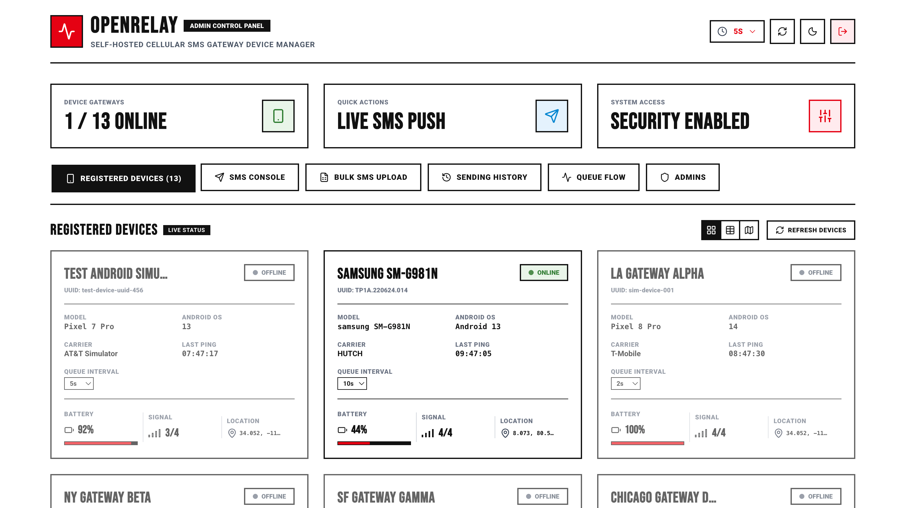
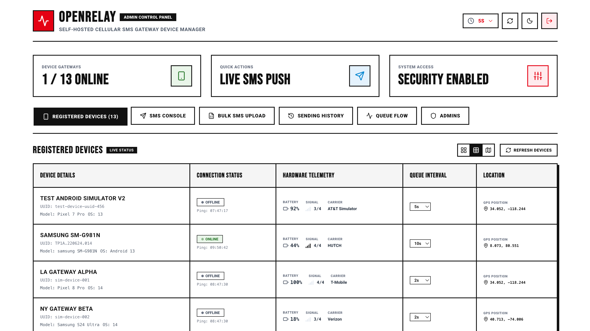
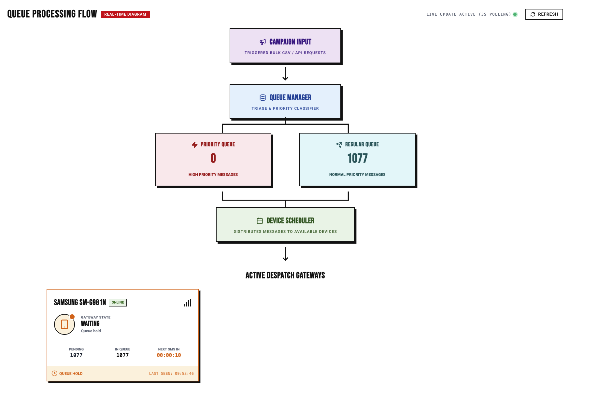
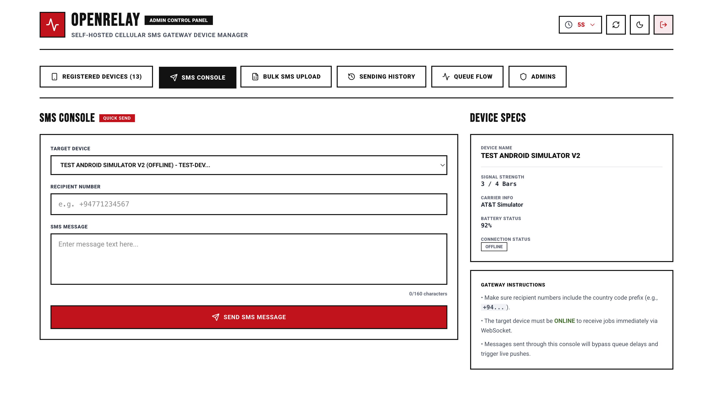
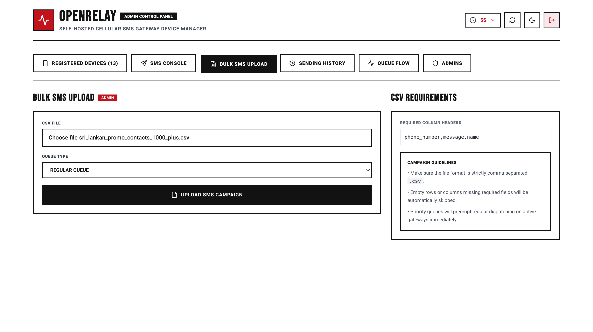
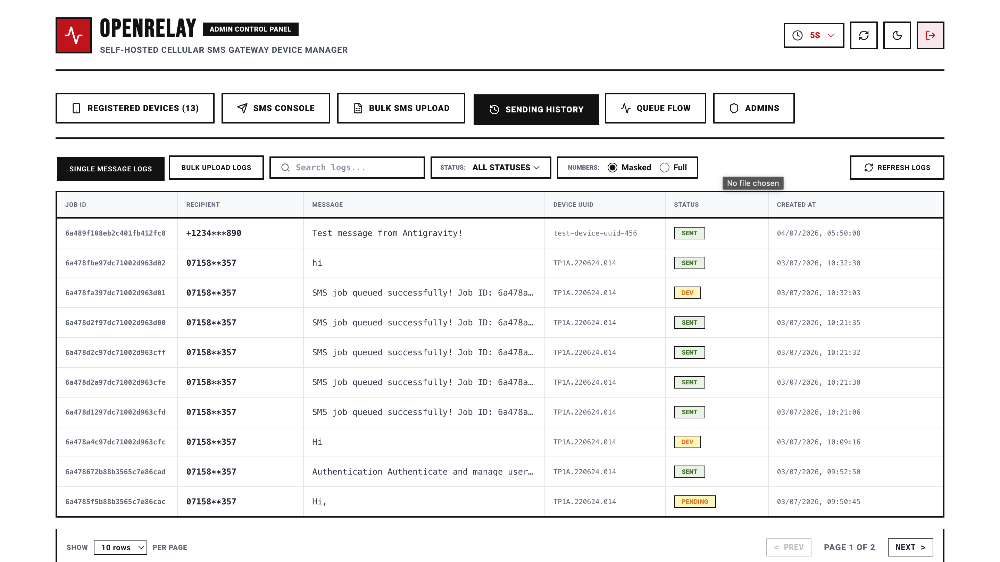
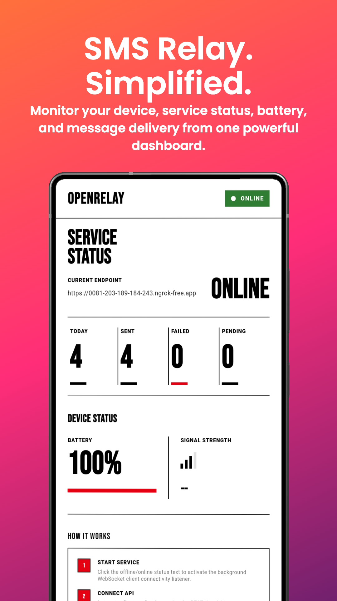
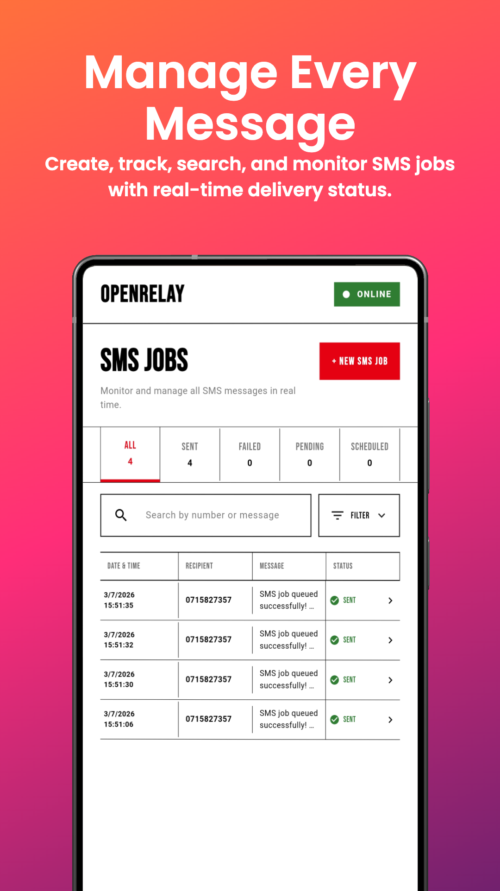
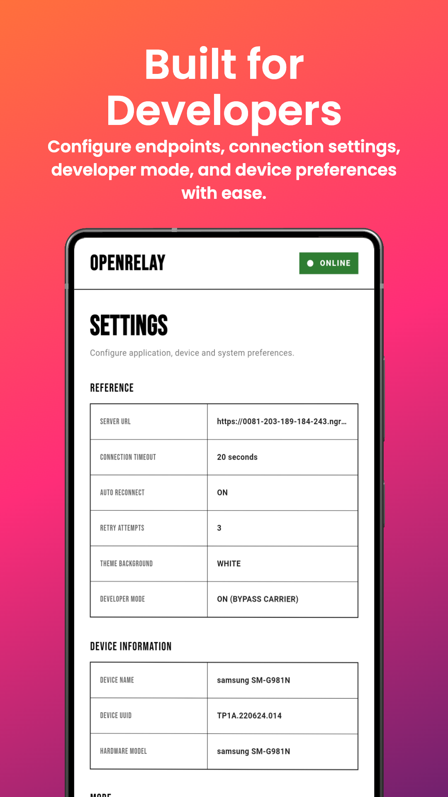

<p align="center">
  <h1 align="center">📡 OpenRelay</h1>
  <p align="center">
    <strong>Self-Hosted SMS Gateway — Turn Android Phones into Programmable SMS Senders</strong>
  </p>
  <p align="center">
    <a href="#quick-start">Quick Start</a> •
    <a href="#architecture">Architecture</a> •
    <a href="#api-reference">API Reference</a> •
    <a href="#admin-dashboard-interface">Dashboard</a> •
    <a href="#android-app-interface">Android App</a> •
    <a href="#how-sms-sending-works">How It Works</a> •
    <a href="#screenshots">Screenshots</a>
  </p>
</p>

---

OpenRelay is an open-source, self-hosted SMS gateway that lets developers send SMS messages programmatically using their own Android devices. No third-party SMS providers, no per-message fees — just your own phones, your own SIM cards, your own infrastructure.

The system consists of three components:

| Component | Tech Stack | Purpose |
|-----------|-----------|---------|
| **Backend** | Python · FastAPI · MongoDB · WebSocket | API server, queue engine, device orchestration |
| **Frontend** | React · TypeScript · Vite · TailwindCSS | Admin dashboard for monitoring and management |
| **Android** | Flutter · Dart · Kotlin (native) | SMS gateway client running on physical devices |

---

## ✨ Features

### Core
- **REST API** — Send single, batch, and bulk SMS via HTTP endpoints
- **Real-time WebSocket** — Persistent bi-directional connection between server and devices
- **Shared Queue Pool** — Atomic claim-based load balancing across multiple devices
- **Priority & Regular Queues** — Urgent messages skip the line; campaigns pace with intervals
- **Automatic Failover** — Failed messages failover to another device, retry up to 3x, then abandon
- **CSV Campaign Upload** — Upload a CSV file to blast thousands of messages

### Device Intelligence
- **Dynamic Device Scoring** — Selects the best device based on signal strength, battery, workload, heartbeat freshness, and SIM availability
- **Heartbeat Monitoring** — Devices send status updates every 15 seconds (battery, signal, GPS, carrier)
- **Auto-Reconnect** — Exponential backoff reconnection when a device goes offline
- **Orphan Job Recovery** — Disconnected device's pending messages return to the shared pool automatically

### Dashboard
- **Live Device Monitor** — Battery, signal, carrier, GPS location, online/offline status
- **Queue Flow Visualization** — Real-time view of message processing pipeline
- **Campaign Tracker** — Progress bars, sent/failed/pending counts per campaign
- **SMS Logs** — Paginated, searchable logs with status filters
- **Admin Management** — Multi-admin accounts with JWT authentication
- **Dev Mode** — Test the full pipeline without actually sending SMS

### Security
- **JWT Authentication** — Devices authenticate via JWT tokens; admin panel uses separate admin JWT
- **PBKDF2 Password Hashing** — Admin passwords hashed with SHA-256 + random salt
- **Role-based Access** — Device endpoints vs admin-only endpoints

---

## 🏗 Architecture

```
┌─────────────────────────────────────────────────────────────┐
│                    Admin Dashboard (React)                   │
│         Login │ SMS │ Bulk │ Devices │ Logs │ Queue          │
└───────────────────────┬─────────────────────────────────────┘
                        │ REST API (HTTP)
┌───────────────────────▼─────────────────────────────────────┐
│                   FastAPI Backend Server                     │
│                                                             │
│  ┌─────────────┐  ┌──────────────┐  ┌───────────────────┐  │
│  │ API v2      │  │ Queue Engine │  │ ConnectionManager │  │
│  │ Endpoints   │  │              │  │   (WebSocket)     │  │
│  │             │  │ global_      │  │                   │  │
│  │ /sms/send   │  │ queue_       │◄─┤ Device UUID →     │  │
│  │ /sms/batch  │  │ processor    │  │ {socket, version} │  │
│  │ /admin/     │  │     │        │  │                   │  │
│  │  bulk-sms   │──┤ device_      │  └───────┬───────────┘  │
│  │  campaign   │  │ queue_worker │          │              │
│  │ /devices/*  │  │     │        │          │              │
│  │ /ws/device  │  │ claim_next   │          │              │
│  └─────────────┘  │ send_queued  │          │              │
│                   └──────┬───────┘          │              │
│                          │                  │              │
│               ┌──────────▼──────────┐       │              │
│               │      MongoDB        │       │              │
│               │                     │       │              │
│               │ • sms_queue         │       │              │
│               │ • devices           │       │              │
│               │ • campaigns         │       │              │
│               │ • bulk_sms_logs     │       │              │
│               │ • sms_jobs          │       │              │
│               │ • users             │       │              │
│               └─────────────────────┘       │              │
└─────────────────────────────────────────────┼──────────────┘
                                              │ WebSocket (wss://)
                    ┌─────────────────────────▼──────────────────────┐
                    │           Android Device(s) (Flutter)          │
                    │                                                │
                    │  BackgroundService (Foreground Notification)   │
                    │       │                                        │
                    │  WebSocketService (Persistent Connection)      │
                    │       │                                        │
                    │  SmsSender (MethodChannel → Kotlin)            │
                    │       │                                        │
                    │  Android SmsManager → Carrier Network → 📱    │
                    └────────────────────────────────────────────────┘
```

### Project Structure

```
OpenRelay/
├── backend/                    # FastAPI server
│   ├── app/
│   │   ├── main.py             # FastAPI app entry, lifespan, CORS
│   │   ├── config.py           # Environment variables & settings
│   │   ├── auth.py             # JWT creation/verification, password hashing
│   │   ├── database_mongo.py   # MongoDB async client (Motor)
│   │   ├── database.py         # SQLAlchemy (legacy, SQLite)
│   │   ├── models.py           # SQLAlchemy models (legacy)
│   │   ├── schemas.py          # Pydantic request/response schemas
│   │   ├── websocket.py        # ConnectionManager (device WS registry)
│   │   ├── queue_manager.py    # Core SMS queue engine
│   │   ├── logger.py           # Colored terminal logger
│   │   └── api/
│   │       ├── v1/             # Legacy API (camelCase)
│   │       └── v2/             # Current API (snake_case)
│   │           └── endpoints/
│   │               ├── admin_auth.py   # Admin login, setup, accounts
│   │               ├── devices.py      # Device register, list, config
│   │               ├── sms.py          # Single & batch SMS sending
│   │               ├── bulk_sms.py     # CSV upload, campaigns, logs, stats
│   │               └── websocket.py    # Device WebSocket endpoint
│   ├── .env                    # Environment configuration
│   ├── requirements.txt        # Python dependencies
│   ├── run.py                  # Uvicorn launcher
│   ├── tunnel.sh               # ngrok tunnel helper script
│   ├── test_client.py          # V1 device simulator
│   └── test_client_v2.py       # V2 device simulator
│
├── frontend/                   # React admin dashboard
│   ├── src/
│   │   ├── App.tsx             # Main app with tab routing
│   │   ├── main.tsx            # React DOM entry
│   │   ├── types.ts            # TypeScript type definitions
│   │   └── components/
│   │       ├── LoginScreen.tsx     # Admin login page
│   │       ├── SetupScreen.tsx     # First-time admin setup
│   │       ├── DashboardHeader.tsx # Top navigation bar
│   │       ├── SmsTab.tsx          # Send single/batch SMS
│   │       ├── BulkTab.tsx         # CSV upload & campaigns
│   │       ├── DevicesTab.tsx      # Device monitoring cards
│   │       ├── LogsTab.tsx         # SMS log viewer
│   │       ├── QueueFlowTab.tsx    # Live queue visualization
│   │       └── AdminTab.tsx        # Admin account management
│   ├── package.json
│   └── vite.config.ts
│
├── android/                    # Flutter mobile app
│   ├── lib/
│   │   ├── main.dart           # App entry point
│   │   ├── constants.dart      # Config constants
│   │   ├── theme.dart          # Material theme
│   │   ├── models/             # Data models (SmsCommand, SmsResult, etc.)
│   │   ├── providers/          # State management (Provider)
│   │   ├── screens/            # UI screens
│   │   └── services/
│   │       ├── api_client.dart         # HTTP REST client
│   │       ├── websocket_service.dart  # WebSocket connection manager
│   │       ├── sms_sender.dart         # MethodChannel → native SMS
│   │       ├── background_service.dart # Foreground service setup
│   │       └── database.dart           # Local SQLite database
│   ├── sms_channel/            # Native Kotlin SMS plugin
│   └── pubspec.yaml
│
├── architec.md                 # Architecture diagrams (Mermaid)
└── requirements.md             # Original project requirements
```

---

## 🚀 Quick Start

### Prerequisites

| Requirement | Version |
|-------------|---------|
| Python | 3.10+ |
| Node.js | 18+ |
| MongoDB | 6.0+ (or MongoDB Atlas) |
| Flutter | 3.x (for Android builds) |
| Android Phone | Android 7.0+ with active SIM |
| ngrok (optional) | For exposing localhost to Android devices |

### 1. Backend Setup

```bash
# Clone the repository
git clone https://github.com/your-org/OpenRelay.git
cd OpenRelay/backend

# Create and activate virtual environment
python3 -m venv .venv
source .venv/bin/activate        # macOS/Linux
# .venv\Scripts\activate         # Windows

# Install dependencies
pip install -r requirements.txt
```

#### Configure Environment

Create a `.env` file in the `backend/` directory:

```env
# MongoDB Connection
MONGO_URI=mongodb://localhost:27017
MONGO_DB_NAME=openrelay

# Security
JWT_SECRET=your-super-secret-key-change-this-in-production

# API Documentation (optional)
DOCS_URL=/docs
REDOC_URL=/redoc
OPENAPI_URL=/openapi.json
ENABLE_DOCS=True
```

> **MongoDB Atlas**: You can use a free MongoDB Atlas cluster. Replace `MONGO_URI` with your Atlas connection string:
> ```
> MONGO_URI=mongodb+srv://<user>:<password>@<cluster>.mongodb.net/?appName=openrelay
> ```

#### Start the Server

```bash
python run.py
```

The server starts at **http://localhost:8000** with hot reload enabled.

- Swagger docs: http://localhost:8000/docs
- ReDoc: http://localhost:8000/redoc

### 2. Frontend Setup

```bash
cd frontend

# Install dependencies
npm install

# Start development server
npm run dev
```

The dashboard opens at **http://localhost:5173**.

On first visit, you'll see the **Setup Screen** to create your initial admin account. After that, you'll be redirected to the login screen.

### 3. Expose Backend to Android (ngrok)

Your Android device needs to reach the backend server. If both are on the same local network, use your machine's local IP. Otherwise, use ngrok:

```bash
cd backend
bash tunnel.sh
# or directly:
ngrok http 8000
```

Copy the ngrok HTTPS URL (e.g., `https://xxxx.ngrok-free.app`) — you'll paste this into the Android app's setup screen.

### 4. Android App Setup

```bash
cd android

# Get Flutter dependencies
flutter pub get

# Build and install on connected device
flutter run
```

In the app:
1. Enter the **Server URL** (your ngrok URL or local IP)
2. Enter a **Device Name**
3. Tap **Register & Connect**
4. The app will register with the server, obtain a JWT token, and establish a WebSocket connection
5. The app runs as a **foreground service** — it stays active even when minimized

---

## ⚙️ Configuration

### Environment Variables

| Variable | Description | Default |
|----------|-------------|---------|
| `MONGO_URI` | MongoDB connection string | `mongodb://localhost:27017` |
| `MONGO_DB_NAME` | MongoDB database name | `openrelay` |
| `JWT_SECRET` | Secret key for JWT token signing | `super-secret-key-change-in-production` |
| `DATABASE_URL` | SQLAlchemy URL (legacy, not actively used) | `sqlite:///./openrelay.db` |
| `DOCS_URL` | Swagger UI path | `/docs` |
| `REDOC_URL` | ReDoc path | `/redoc` |
| `OPENAPI_URL` | OpenAPI JSON schema path | `/openapi.json` |
| `ENABLE_DOCS` | Enable/disable API documentation | `True` |

### Device Configuration

Each device has a configurable `regular_interval` parameter (default: **2.0 seconds**) that controls the delay between regular queue messages. This can be updated per-device via the API or the dashboard:

```bash
curl -X POST http://localhost:8000/api/v2/devices/{device_uuid}/config \
  -H "Authorization: Bearer $ADMIN_TOKEN" \
  -H "Content-Type: application/json" \
  -d '{"regular_interval": 3.0}'
```

---

## 📡 API Reference

All endpoints are under `/api/v2`. The server also serves V1 endpoints at `/api/v1` and legacy aliases at root for backwards compatibility.

### Authentication

#### Setup Check
```http
GET /api/v2/admin/setup-check
```
Returns `{"setup_required": true}` if no admin accounts exist.

#### Create Admin Account
```http
POST /api/v2/admin/add-account
Content-Type: application/json

{
  "username": "admin",
  "password": "your-password"
}
```
First account can be created without auth. Subsequent accounts require admin JWT.

#### Admin Login
```http
POST /api/v2/admin/login
Content-Type: application/json

{
  "username": "admin",
  "password": "your-password"
}
```
**Response:**
```json
{
  "token": "eyJhbGciOi...",
  "username": "admin"
}
```

---

### Devices

> All device management endpoints require admin JWT: `Authorization: Bearer <admin_token>`

#### Register Device
```http
POST /api/v2/devices/register
Content-Type: application/json

{
  "uuid": "device-unique-id",
  "name": "My Phone",
  "model": "Pixel 7",
  "android_version": "14",
  "carrier": "Dialog",
  "latitude": 6.9271,
  "longitude": 79.8612
}
```
**Response:**
```json
{
  "device_id": "device-unique-id",
  "token": "eyJhbGciOi..."
}
```

#### List All Devices
```http
GET /api/v2/devices/
Authorization: Bearer <admin_token>
```

#### Update Device Config
```http
POST /api/v2/devices/{device_uuid}/config
Authorization: Bearer <admin_token>
Content-Type: application/json

{
  "regular_interval": 3.0
}
```

---

### SMS Sending

> All SMS endpoints require admin JWT.

#### Send Single SMS (Priority)
```http
POST /api/v2/sms/send
Authorization: Bearer <admin_token>
Content-Type: application/json

{
  "device_id": "device-uuid",
  "to": "+94771234567",
  "message": "Hello from OpenRelay!"
}
```
**Response:**
```json
{
  "job_id": "668f1a2b3c4d5e6f7a8b9c0d",
  "status": "QUEUED"
}
```

#### Send Batch SMS (Priority)
```http
POST /api/v2/sms/batch
Authorization: Bearer <admin_token>
Content-Type: application/json

{
  "device_id": "device-uuid",
  "messages": [
    {"to": "+94771234567", "message": "Hello!"},
    {"to": "+94779876543", "message": "Hi there!"}
  ]
}
```

#### Upload CSV for Bulk SMS (Regular)
```http
POST /api/v2/admin/bulk-sms
Authorization: Bearer <admin_token>
Content-Type: multipart/form-data

file: <your-file.csv>
queue_type: REGULAR  (or PRIORITY)
```

**CSV Format:**
```csv
phone_number,message,name
+94771234567,Hello John!,John
+94779876543,Hi Jane!,Jane
```

#### Create Campaign (Regular)
```http
POST /api/v2/admin/campaign
Authorization: Bearer <admin_token>
Content-Type: application/json

{
  "message": "Holiday sale! 50% off everything!",
  "recipients": ["+94771234567", "+94779876543", "+94771111111"],
  "queue_type": "REGULAR"
}
```

---

### Monitoring

#### Get Queue Statistics
```http
GET /api/v2/admin/queue/stats
Authorization: Bearer <admin_token>
```
**Response:**
```json
{
  "priority_queue_count": 5,
  "regular_queue_count": 142,
  "unassigned_count": 100,
  "devices": [
    {
      "uuid": "device-1",
      "name": "Pixel 7",
      "status": "online",
      "action": "sending",
      "battery": 85,
      "signal": 3,
      "carrier": "Dialog",
      "sent_count": 230,
      "pending_count": 15,
      "success_rate": 97.5,
      "speed": 0.5,
      "next_send_in": 1.2,
      "regular_interval": 2.0
    }
  ],
  "timestamp": "2026-07-05T12:00:00"
}
```

#### Get Campaigns
```http
GET /api/v2/admin/campaigns
Authorization: Bearer <admin_token>
```

#### Get SMS Logs (Paginated)
```http
GET /api/v2/admin/bulk-sms/logs?page=1&page_size=20&search=+9477&status=SENT
Authorization: Bearer <admin_token>
```

```http
GET /api/v2/sms/logs?page=1&page_size=20&search=hello&status=FAILED
Authorization: Bearer <admin_token>
```

---

### WebSocket

#### Device Connection
```
wss://your-server.com/api/v2/ws/device?token=<device_jwt>
```

**Server → Device (Send SMS command):**
```json
{
  "type": "SEND_SMS",
  "job_id": "668f1a2b3c4d5e6f7a8b9c0d",
  "to": "+94771234567",
  "message": "Hello!"
}
```

**Device → Server (Report result):**
```json
{
  "type": "RESULT",
  "job_id": "668f1a2b3c4d5e6f7a8b9c0d",
  "status": "SENT"
}
```

**Device → Server (Status heartbeat, every 15s):**
```json
{
  "type": "STATUS_UPDATE",
  "battery": 85,
  "signal": 3,
  "carrier": "Dialog",
  "latitude": 6.9271,
  "longitude": 79.8612
}
```

---

## 📱 Admin Dashboard

The dashboard provides a full-featured admin interface with the following tabs:

| Tab | Description |
|-----|-------------|
| **SMS** | Send single or batch SMS to specific devices |
| **Bulk** | Upload CSV files, create campaigns, track progress |
| **Devices** | Live device cards with battery, signal, carrier, GPS, and per-device config |
| **Logs** | Searchable, filterable, paginated SMS delivery logs |
| **Queue Flow** | Real-time visualization of the message processing pipeline |
| **Admin** | Manage admin accounts (add/remove) |

### First-Time Setup Flow

1. Open `http://localhost:5173`
2. The app checks `/api/v2/admin/setup-check`
3. If no admin exists → **Setup Screen** appears → create your first admin
4. Login with your credentials
5. You're in the dashboard

---

## 📲 Android App

The Flutter-based Android app acts as an SMS modem. It:

1. **Registers** with the backend and receives a JWT token
2. **Connects** via WebSocket (persistent, foreground service)
3. **Receives** `SEND_SMS` commands from the server
4. **Sends** SMS via Android's native `SmsManager` (Kotlin MethodChannel)
5. **Reports** result (`SENT`/`FAILED`) back via WebSocket
6. **Broadcasts** status updates every 15 seconds (battery, signal, carrier, GPS)
7. **Auto-reconnects** with exponential backoff if connection drops

### Required Android Permissions

```xml
SEND_SMS              <!-- Send SMS messages -->
READ_PHONE_STATE      <!-- Read carrier/SIM info -->
FOREGROUND_SERVICE    <!-- Keep service alive in background -->
ACCESS_FINE_LOCATION  <!-- GPS coordinates (optional) -->
```

### Dev Mode

The Android app supports a **Dev Mode** toggle that bypasses actual SMS sending. When enabled:
- SMS commands are received and logged normally
- Instead of calling `SmsManager`, the result is immediately reported as `dev`
- Useful for testing the full pipeline without consuming SMS credits

---

## 🔄 How SMS Sending Works

### End-to-End Flow

```
1. Admin submits SMS          POST /api/v2/sms/send
                                      │
2. Backend creates job        Insert into MongoDB sms_queue
                              (status: QUEUED, device_uuid: None)
                                      │
3. Queue processor detects    global_queue_processor() runs every 1s
   online devices             Spawns device_queue_worker per device
                                      │
4. Worker claims message      claim_next_message() → findOneAndUpdate
                              (atomic: QUEUED → PROCESSING)
                                      │
5. Push to device             send_queued_message() → WebSocket push
                              {type: SEND_SMS, job_id, to, message}
                                      │
6. Android receives           WebSocketService._handleSmsCommand()
                                      │
7. Send via carrier           SmsSender.sendSms() → MethodChannel
                              → Kotlin → SmsManager.sendTextMessage()
                                      │
8. Report result              {type: RESULT, job_id, status: SENT}
                              → WebSocket → Backend
                                      │
9. Resolve & update           pending_results[job_id].set_result("SENT")
                              Update sms_queue, sms_jobs, bulk_sms_logs
```

### Queue Types

| Type | Use Case | Behavior |
|------|----------|----------|
| **PRIORITY** | Single SMS, batch SMS | Processed immediately, no delay between messages |
| **REGULAR** | CSV bulk, campaigns | Paced with configurable `regular_interval` (default 2s) |

Priority always preempts regular — if a priority message arrives while a device is waiting between regular messages, the regular interval sleep breaks early.

### Shared Pool Load Balancing

Messages are inserted into `sms_queue` with `device_uuid = None` (unassigned). Every connected device's worker atomically claims the next available message using MongoDB's `findOneAndUpdate`. This means:

- **No pre-assignment** — messages aren't tied to a specific device
- **Automatic balancing** — faster devices naturally process more
- **No single point of failure** — if a device dies, its unclaimed messages stay in the pool

### Failure Strategy (3-Tier)

```
Attempt fails
    │
    ├─► Tier 1: FAILOVER
    │   Try another online device (exclude already-failed devices)
    │   Reset retry count for the new device
    │
    ├─► Tier 2: RETRY
    │   No other devices available
    │   Retry on same device (up to 3 total attempts)
    │
    └─► Tier 3: ABANDON
        All retries exhausted, no failover possible
        Mark as ABANDONED / FAILED
```

### Device Disconnect Recovery

When a device disconnects:
1. `WebSocketDisconnect` fires in the WebSocket endpoint
2. `reassign_device_jobs()` unassigns all its PENDING/QUEUED/PROCESSING jobs back to pool (`device_uuid → None`)
3. `global_queue_processor()` also sweeps for orphaned jobs every second as a safety net
4. Other online devices' workers will claim the re-pooled messages

### Device Selection Scoring

When the system needs to pick a device (for failover), it uses a weighted scoring algorithm:

| Factor | Weight (Normal) | Weight (Campaign) |
|--------|:---------------:|:-----------------:|
| Signal Strength | 35% | 30% |
| Workload (fewer pending = better) | 30% | 15% |
| Battery Level | 20% | 40% |
| SIM Availability | 10% | 10% |
| Heartbeat Freshness | 5% | 5% |

Campaign mode prioritizes battery (for long-running batches). Normal mode prioritizes signal and low workload.

---

## 🗄 Database Schema

### MongoDB Collections

#### `sms_queue` — Central Dispatch Queue
```json
{
  "_id": "ObjectId",
  "campaign_id": "ObjectId | null",
  "device_uuid": "string | null",
  "phone_number": "+94771234567",
  "message": "Hello!",
  "name": "John",
  "queue_type": "PRIORITY | REGULAR",
  "status": "QUEUED | PROCESSING | SENT | FAILED | ABANDONED",
  "retry_count": 0,
  "failed_devices": ["device-uuid-1"],
  "error_detail": "string | null",
  "created_at": "datetime",
  "updated_at": "datetime",
  "sent_at": "datetime | null"
}
```

#### `devices` — Device Registry
```json
{
  "uuid": "device-unique-id",
  "name": "My Phone",
  "model": "Pixel 7",
  "android_version": "14",
  "token": "jwt-token",
  "status": "online | offline",
  "battery": 85,
  "signal": 3,
  "carrier": "Dialog",
  "latitude": 6.9271,
  "longitude": 79.8612,
  "regular_interval": 2.0,
  "last_seen": "datetime"
}
```

#### `campaigns` — Campaign Metadata
```json
{
  "_id": "ObjectId",
  "name": "contacts.csv",
  "total_count": 500,
  "queue_type": "REGULAR",
  "created_at": "datetime"
}
```

#### `users` — Admin Accounts
```json
{
  "username": "admin",
  "password": "salt_hex:key_hex",
  "role": "admin"
}
```

#### `sms_jobs` — Single/Batch SMS Logs (backwards compatibility)
#### `bulk_sms_logs` — Bulk/Campaign SMS Logs (backwards compatibility)

### Message Status Lifecycle

```
QUEUED ──► PROCESSING ──► SENT ✅
                │
                ▼
              FAILED ──► (failover/retry) ──► QUEUED ...
                │
                ▼
            ABANDONED ❌ (after exhausting all options)
```

---

## 🧪 Testing

### Simulated Device (No Android Required)

The project includes mock device simulators for testing the complete pipeline without a physical phone:

```bash
cd backend
source .venv/bin/activate

# V1 simulator
python test_client.py

# V2 simulator (recommended)
python test_client_v2.py
```

The simulator:
1. Registers a test device (`test-device-uuid-123`)
2. Authenticates and receives a JWT
3. Establishes a WebSocket connection
4. Sends periodic heartbeat/status updates
5. Automatically responds to `SEND_SMS` commands with `RESULT: SENT`

### Test with curl

```bash
# 1. Login to get admin token
TOKEN=$(curl -s -X POST http://localhost:8000/api/v2/admin/login \
  -H "Content-Type: application/json" \
  -d '{"username":"admin","password":"your-password"}' | python3 -c "import sys,json; print(json.load(sys.stdin)['token'])")

# 2. Send a test SMS
curl -X POST http://localhost:8000/api/v2/sms/send \
  -H "Authorization: Bearer $TOKEN" \
  -H "Content-Type: application/json" \
  -d '{
    "device_id": "test-device-uuid-123",
    "to": "+94771234567",
    "message": "Hello from OpenRelay!"
  }'

# 3. Check queue stats
curl -s http://localhost:8000/api/v2/admin/queue/stats \
  -H "Authorization: Bearer $TOKEN" | python3 -m json.tool
```

---

## 🌐 Deployment

### Expose to the Internet

#### Option A: ngrok (Development)
```bash
ngrok http 8000
```
Copy the HTTPS forwarding URL into the Android app.

#### Option B: Reverse Proxy (Production)

Use Nginx or Caddy as a reverse proxy with SSL:

```nginx
server {
    listen 443 ssl;
    server_name sms.yourdomain.com;

    ssl_certificate /path/to/cert.pem;
    ssl_certificate_key /path/to/key.pem;

    location / {
        proxy_pass http://127.0.0.1:8000;
        proxy_http_version 1.1;
        proxy_set_header Upgrade $http_upgrade;
        proxy_set_header Connection "upgrade";
        proxy_set_header Host $host;
        proxy_set_header X-Real-IP $remote_addr;
    }
}
```

> **Important**: WebSocket connections require the `Upgrade` and `Connection` headers to be forwarded.

### Production Checklist

- [ ] Change `JWT_SECRET` to a strong random string
- [ ] Set `ENABLE_DOCS=False` to disable Swagger in production
- [ ] Use MongoDB Atlas or a secured MongoDB instance
- [ ] Set up SSL/TLS (required for `wss://` WebSocket)
- [ ] Build the frontend: `cd frontend && npm run build` — serve the `dist/` folder
- [ ] Run Uvicorn with production settings: `uvicorn app.main:app --host 0.0.0.0 --port 8000 --workers 1`
- [ ] Use a process manager (systemd, PM2, or supervisor) to keep the backend running

> **Note**: The queue manager uses `asyncio` tasks. Use `--workers 1` with Uvicorn to avoid multiple queue processors competing. For horizontal scaling, separate the queue processor into its own service.

---

## 🔑 API Versioning

| Version | Prefix | Key Convention | Status |
|---------|--------|----------------|--------|
| V1 | `/api/v1` | camelCase (`jobId`, `deviceId`) | Legacy, maintained |
| V2 | `/api/v2` | snake_case (`job_id`, `device_id`) | **Current, recommended** |

Legacy aliases are also available at the root path (e.g., `/devices/register`) pointing to V1 endpoints.

---

## 🛠 Tech Stack Details

### Backend
| Package | Purpose |
|---------|---------|
| FastAPI | Async web framework with OpenAPI |
| Motor | Async MongoDB driver |
| PyJWT | JWT token creation & verification |
| Uvicorn | ASGI server |
| SQLAlchemy | Legacy database support |
| Pydantic | Request/response validation |
| python-dotenv | Environment configuration |
| python-multipart | File upload support |

### Frontend
| Package | Purpose |
|---------|---------|
| React 19 | UI framework |
| TypeScript | Type safety |
| Vite | Build tool & dev server |
| TailwindCSS 4 | Utility-first CSS |
| Lucide React | Icon library |

### Android
| Package | Purpose |
|---------|---------|
| Flutter | Cross-platform UI framework |
| web_socket_channel | WebSocket client |
| flutter_background_service | Foreground service |
| battery_plus | Battery level monitoring |
| geolocator | GPS coordinates |
| sqflite | Local SMS job log |
| shared_preferences | Config persistence |
| provider | State management |

---

---

## Screenshots

Below is a visual preview of the OpenRelay system. For a fully detailed breakdown of each screen and view mode, refer to [SCREENSHOTS.md](SCREENSHOTS.md).

### Web Admin Dashboard

The web dashboard provides real-time tracking, device monitoring, log access, and campaign dispatch.

#### Device Registry and Telemetry Monitoring
Monitor connected Android gateways in real-time. Features card-based and list-based layouts with indicators for connection status, battery, signal strength, cellular carrier, and GPS coordinates.

| Card View | Table View |
|---|---|
|  |  |

#### Queue Flow Visualization
Visual diagram of the dynamic message triaging and processing pipelines, showing current loads in the priority and regular queues alongside individual gateway dispatch statuses.



#### SMS Console and Campaign Dispatch
Send single messages using a designated gateway device or perform large-scale CSV campaigns.

| Single SMS Console | Bulk CSV Campaign Upload |
|---|---|
|  |  |

#### Logs and Sending History
Review paginated and searchable logs of single and bulk dispatch jobs. Includes options to toggle telephone number masking.



---

### Android Companion Application

The Flutter-based companion app acts as an autonomous cellular gateway on your phone.

#### Connection Dashboard and Device Telemetry
Controls background service connection states, visualizes current transmission counts, and transmits local telemetry (battery, signal, GPS) back to the server.



#### Message Job Log and Configuration Settings
Manage active local transmission jobs, view background connection logs, and set configuration profiles.

| Local Job Logs | System Configuration |
|---|---|
|  |  |

---

## License

This project is open-source. See the [LICENSE](LICENSE) file for details.

---

<p align="center">
  <strong>Built with OpenRelay — Your phones, your SIMs, your gateway.</strong>
</p>
