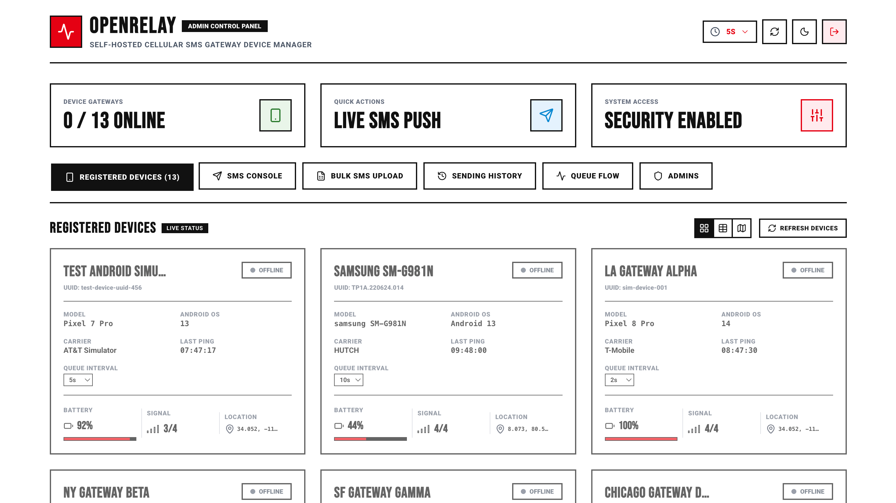
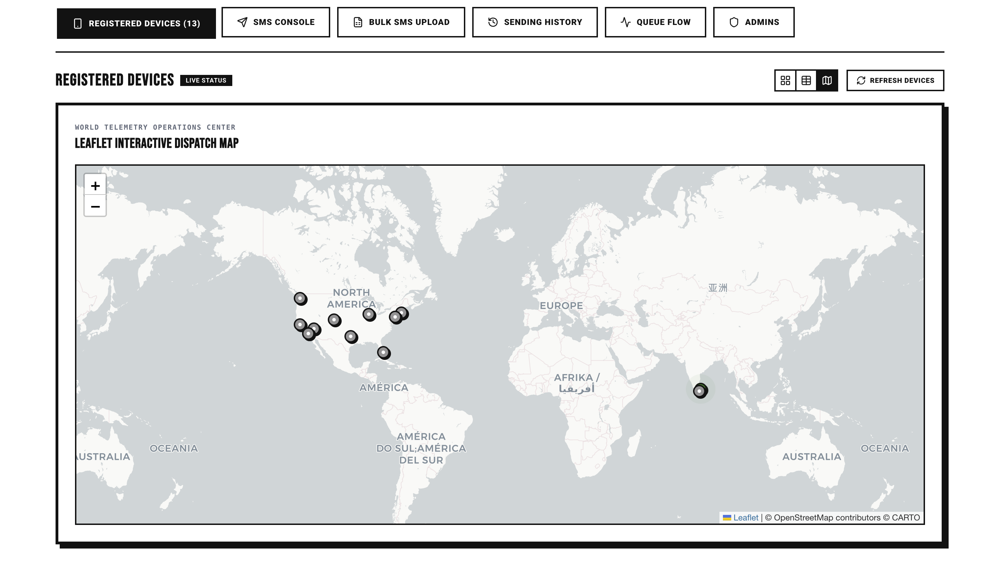
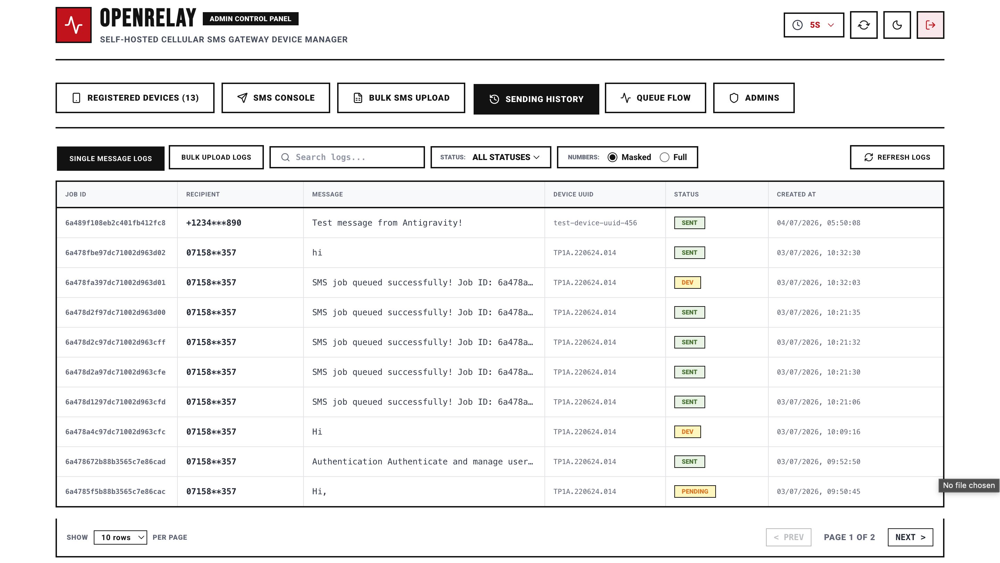
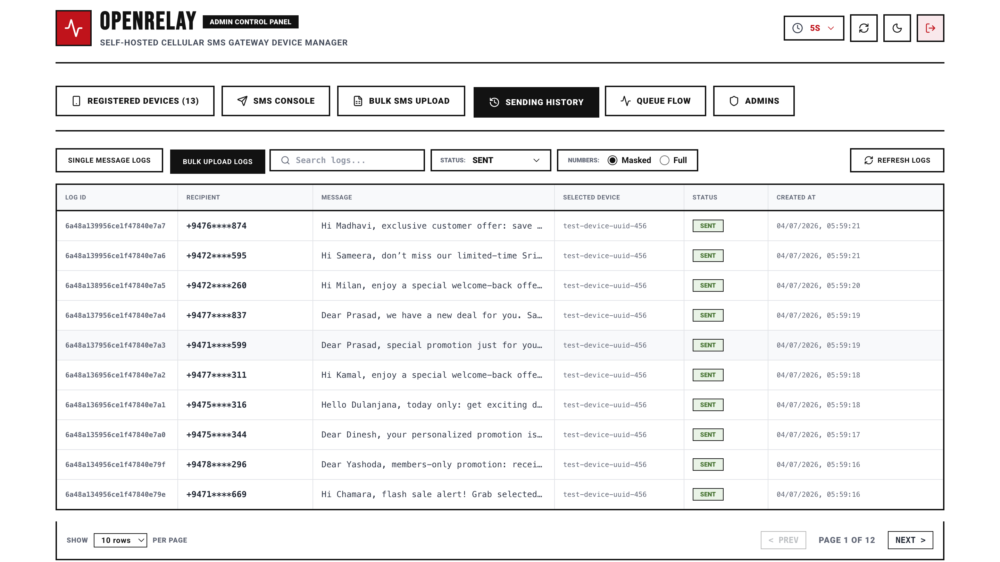
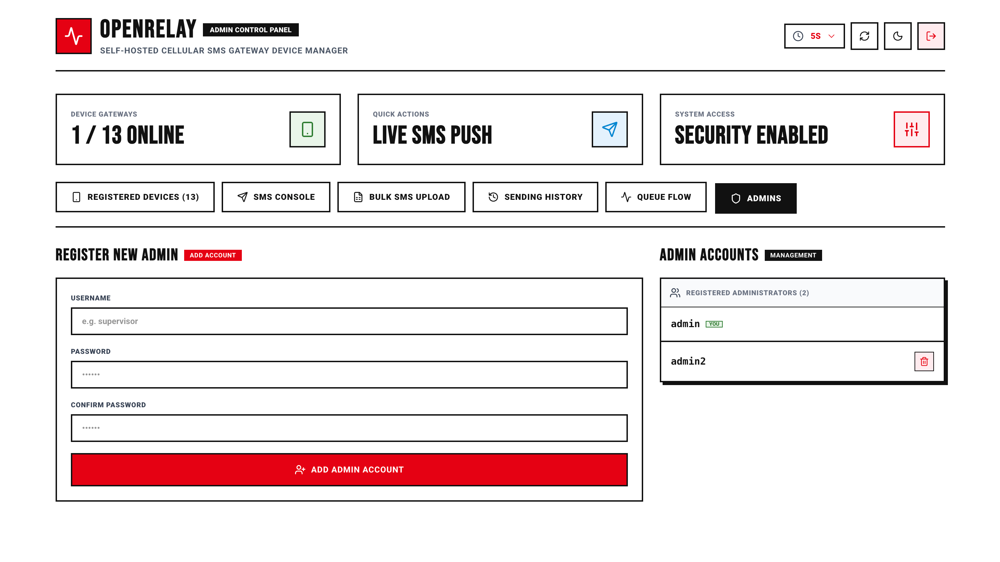
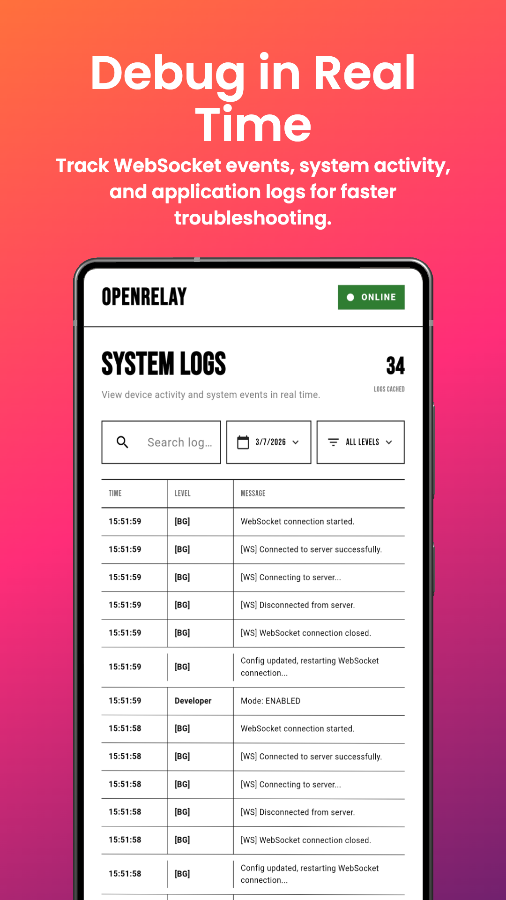
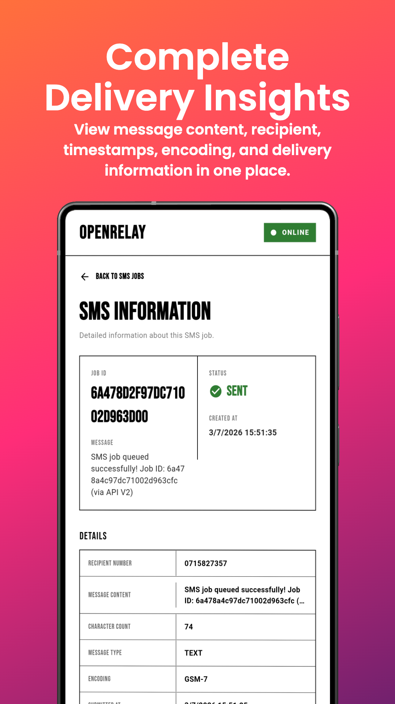

  <h1 align="center">📸 OpenRelay — Screenshots</h1>
  

    A visual tour of the Admin Dashboard and Android companion app.
  

---

## 📑 Table of Contents

- [Admin Dashboard (Web)](#-admin-dashboard-web)
  - [Device Management](#1-device-management)
  - [SMS Console](#2-sms-console)
  - [Bulk SMS Upload](#3-bulk-sms-upload)
  - [Sending History & Logs](#4-sending-history--logs)
  - [Queue Flow Visualization](#5-queue-flow-visualization)
  - [Admin Account Management](#6-admin-account-management)
- [Android App (Mobile)](#-android-app-mobile)
  - [Service Dashboard](#1-service-dashboard)
  - [SMS Jobs Manager](#2-sms-jobs-manager)
  - [System Logs](#3-system-logs)
  - [Settings & Configuration](#4-settings--configuration)
  - [SMS Job Detail](#5-sms-job-detail)

---

## 🖥 Admin Dashboard (Web)

### 1. Device Management

The Registered Devices tab provides three different view modes to monitor all connected Android gateways in real time.

#### Card View (Grid)

Live device cards showing name, UUID, model, Android version, carrier, last ping time, configurable queue interval, battery level, signal strength, and GPS coordinates. Online devices are highlighted with a green badge.

#### Card View (All Offline)

When no devices are currently connected, all cards display an "OFFLINE" badge with the last known telemetry data preserved.

#### Table View

A compact tabular layout with sortable columns: Device Details, Connection Status, Hardware Telemetry (battery, signal, carrier), Queue Interval, and GPS Position.

#### Map View

Interactive Leaflet world map pinpointing the GPS locations of all registered devices globally.

---

### 2. SMS Console

The SMS Console tab provides a quick-send interface for dispatching individual messages through a specific device.

**Features:**
- Target device dropdown with online/offline status indicators
- Recipient number input with country code format guidance
- Message text area with 160-character counter
- Live device specs panel showing signal, carrier, battery, and connection state
- Gateway instructions sidebar

---

### 3. Bulk SMS Upload

Upload CSV files to dispatch large volumes of messages. Supports queue type selection (Regular or Priority) with campaign guidelines.

**Features:**
- CSV file picker
- Queue type selector (Regular / Priority)
- CSV format requirements panel showing required headers: `phone_number,message,name`
- Campaign guidelines: CSV format rules, empty row handling, priority queue behavior

---

### 4. Sending History & Logs

The Sending History tab provides comprehensive log viewing with two sub-tabs: **Single Message Logs** and **Bulk Upload Logs**.

#### Single Message Logs

View all individual SMS jobs with columns for Job ID, Recipient (masked by default), Message preview, Device UUID, Status badge (SENT / DEV / PENDING), and Created At timestamp. Supports search, status filtering, number masking toggle, and pagination.

#### Single Message Logs (Full View)

Same view scrolled to show the complete table with pagination controls (PREV / NEXT) and rows-per-page selector.

#### Bulk Upload Logs

Bulk/campaign-specific log view showing sent messages with their respective campaign device assignments. Filtered by status (e.g., SENT) with masking applied to phone numbers.

---

### 5. Queue Flow Visualization

A real-time visual diagram of the message processing pipeline with live-updating counts. Polls every 3 seconds.

**Flow:**
- **Campaign Input** → Triggered by bulk CSV / API requests
- **Queue Manager** → Triage & priority classifier
- **Priority Queue** (high priority) | **Regular Queue** (normal priority) → live message counts
- **Device Scheduler** → Distributes to available devices
- **Active Dispatch Gateways** → Per-device card showing:
  - Gateway state (SENDING / WAITING / IDLE)
  - Pending, In Queue, and Next SMS countdown
  - Queue hold indicator and last seen timestamp

---

### 6. Admin Account Management

Manage administrator accounts for the dashboard. Create new admins, view the registered administrators list, and delete accounts (with self-deletion protection).

**Features:**
- Register New Admin form (username, password, confirm password)
- Admin Accounts panel showing registered administrators count
- "YOU" badge on the currently logged-in admin
- Delete button on other admin accounts (trash icon)

---

## 📱 Android App (Mobile)

### 1. Service Dashboard

The main screen of the Android companion app showing real-time device and service status.

**Displays:**
- Connection status badge (ONLINE / OFFLINE)
- Current server endpoint URL
- Today's SMS statistics: Total, Sent, Failed, Pending
- Device telemetry: Battery percentage with progress bar, Signal strength with bar indicator
- "How It Works" quick reference guide

---

### 2. SMS Jobs Manager

Browse, search, and filter all SMS jobs processed by the device.

**Features:**
- Tab-based status filter: ALL, SENT, FAILED, PENDING, SCHEDULED with counts
- Search bar for filtering by phone number or message content
- Filter dropdown for additional sorting
- Sortable table columns: Date & Time, Recipient, Message, Status
- Status badges with green checkmarks for SENT

---

### 3. System Logs

Real-time system and WebSocket event log viewer for debugging and troubleshooting.

**Features:**
- Searchable logs with date picker and level filter (ALL LEVELS / BG / WS / Developer)
- Cached log count indicator
- Log entries showing: Time, Level tag, Message
- Tracks WebSocket lifecycle events: connection started, connected, disconnected, closed
- Developer mode toggle events

---

### 4. Settings & Configuration

Full device and application configuration panel.

**Reference Settings:**
- Server URL (ngrok or custom endpoint)
- Connection Timeout (configurable)
- Auto Reconnect toggle
- Retry Attempts count
- Theme Background preference
- Developer Mode (ON — Bypass Carrier)

**Device Information:**
- Device Name, UUID, Hardware Model

---

### 5. SMS Job Detail

Detailed view of a single SMS job with complete delivery metadata.

**Information displayed:**
- Job ID and Status badge (SENT ✅)
- Created At timestamp
- Full message content
- Recipient Number
- Message Content
- Character Count
- Message Type (TEXT)
- Encoding (GSM-7)
- Submitted At timestamp

---

  <em>All screenshots captured from a live OpenRelay deployment.</em>

